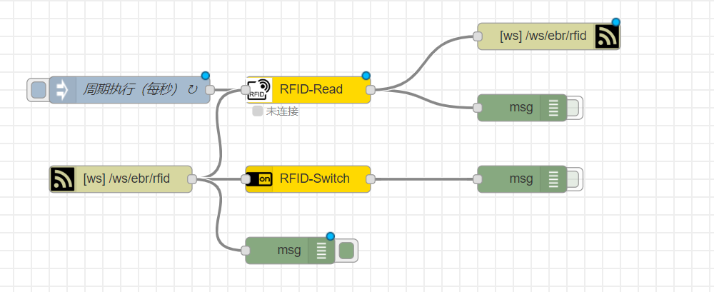

# RFID说明

## RFID接口说明

#### 打开数据数据

```
url：ws://localhost：1880/ws/ebr/rfid


返回值：
{"ID":"c36b6b5b","data":"limengsong\u0000\u0000\u0000\u0000\u0000\u0000"}


```

#### RFID驱动数据流说明：




1. 手环终端采用周期读卡的方式，周期时间可自定义配置。

1. 手环终端Server端采用websocket，当有client连接数>=1时，设备打开（仅打开一次）。 当有client连接数=0时，设备自动关闭。

