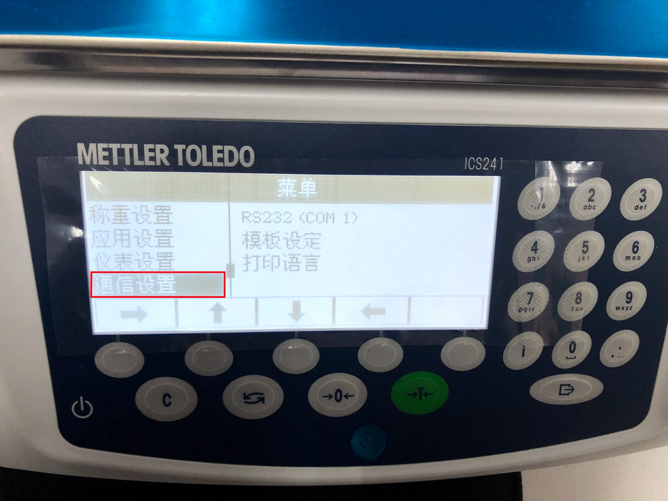
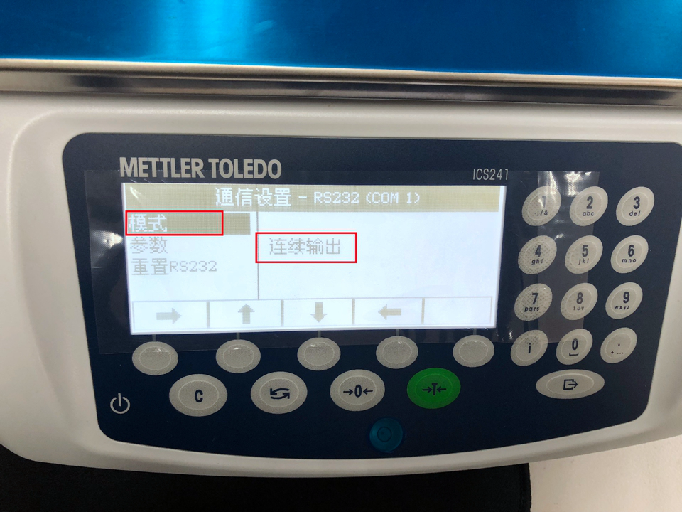
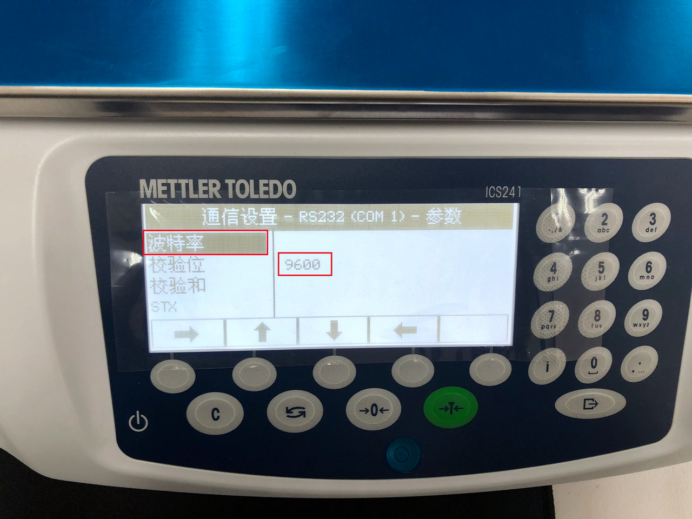
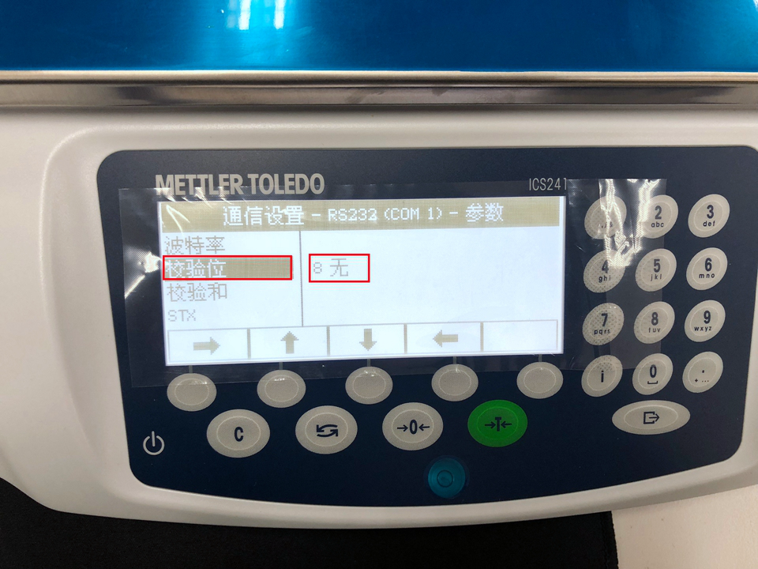
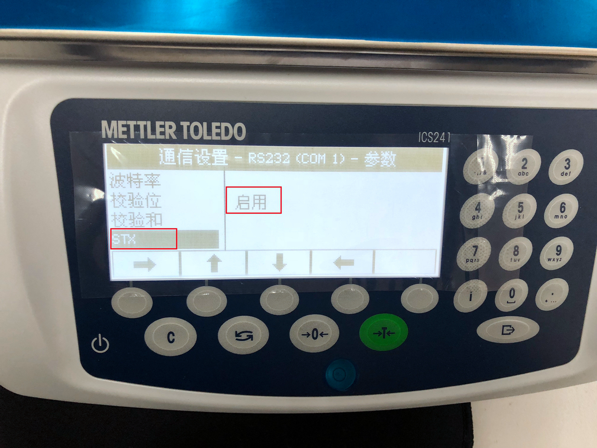

# 电子称说明

# 一 电子称接口列表

#### 端口打开获取实时数据

```
url：ws：//localhost:1880/ws/ebr/scale

返回值：
{"value":"11.8 g","status":"open"}
```


#### 端口关闭获取当前实际数据

```
url：http://localhost:1880/close_scale
type：GET

返回值：
{"value":"0.8 g","status":"close"}
```


#### 电子称通讯设置（重要）









